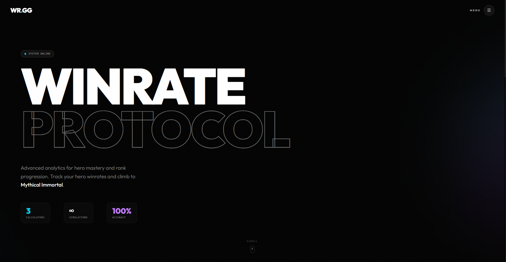
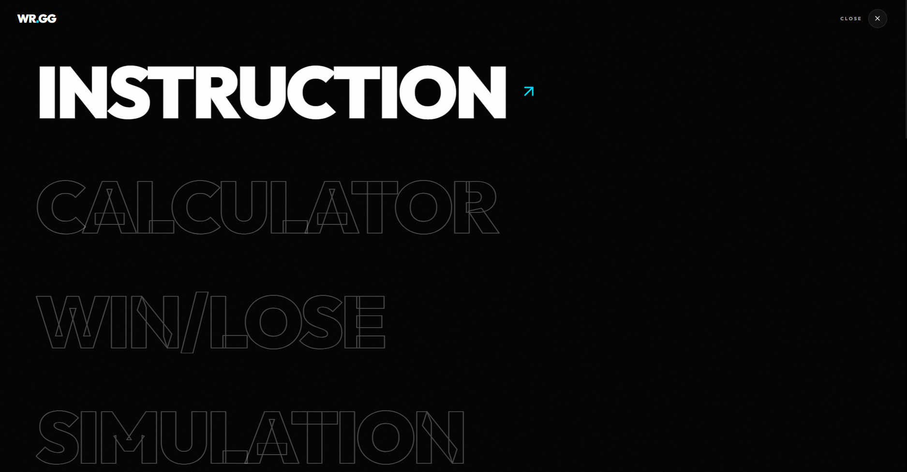
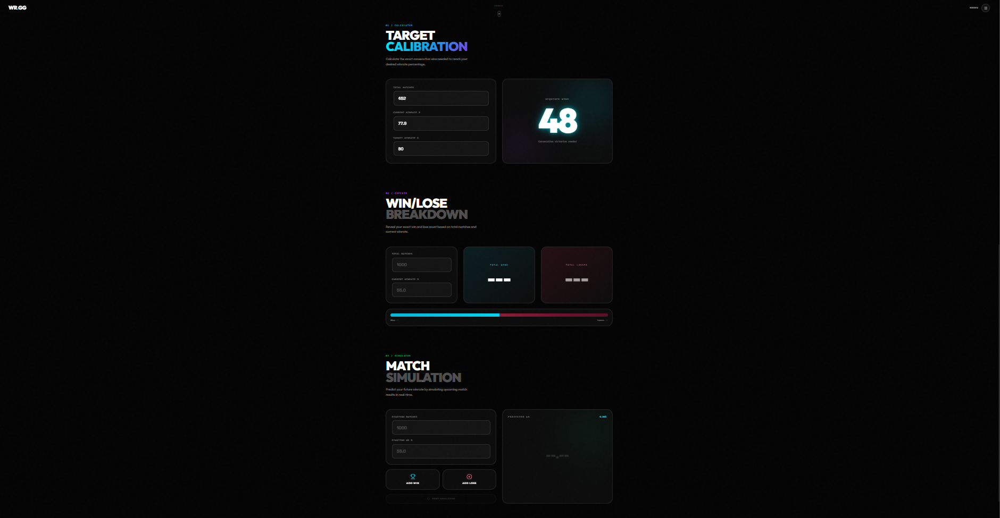

# ⚔️ Winrate Protocol

<div align="center">


**Premium Winrate Calculator for Mobile Legends**

*Track hero performance & plan your climb to Mythical Immortal*

</div>

---

## 📸 Preview

<div align="center">







</div>

---

## ✨ Features

| Feature | Description |
|---------|-------------|
| 🎯 **Target Calculator** | Calculate consecutive wins needed to reach your goal winrate |
| 📊 **Win/Lose Checker** | See exact win and loss count from your stats |
| 🎮 **Match Simulator** | Predict future winrate by simulating match outcomes |
| 📖 **Built-in Guide** | Interactive instructions accessible from the menu |

---

## 🚀 Quick Start

```bash
# Clone repository
git clone https://github.com/Faizpi/Calculator-Win-Rate.git
cd Calculator-Win-Rate

# Install dependencies
npm install

# Start development server
npm run dev
```

---

## 🛠️ Tech Stack

| Technology | Purpose |
|------------|---------|
| React + Vite | Core Framework |
| Tailwind CSS v4 | Styling |
| Framer Motion | Animations |
| Lucide React | Icons |

---

## 📄 License

MIT License

---

<div align="center">

**Made for Mobile Legends Players**

</div>
